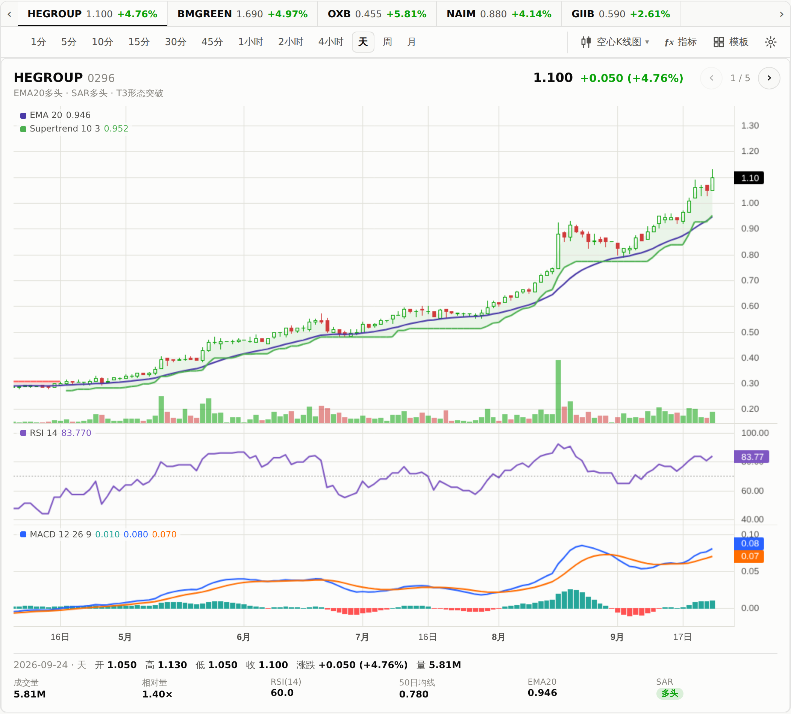
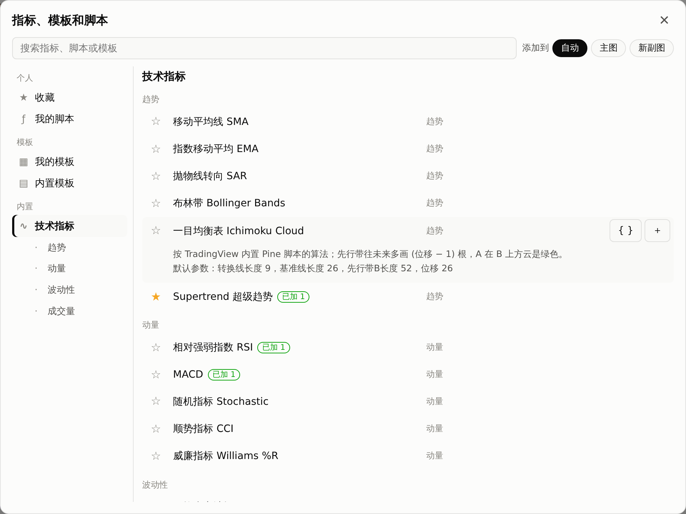
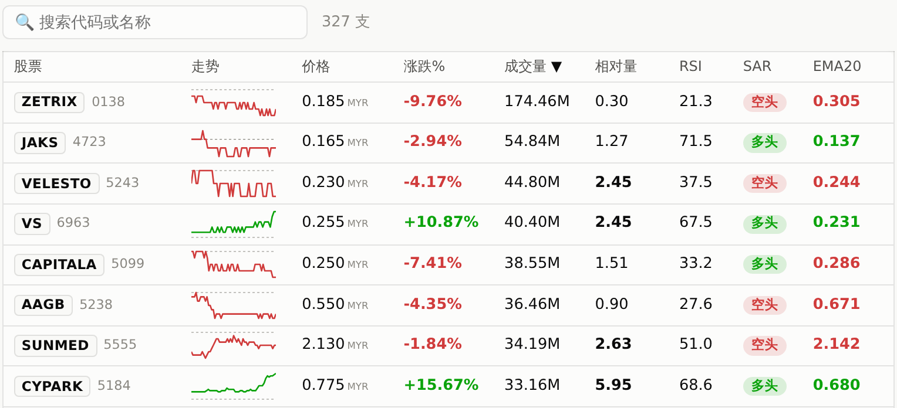

# 📢 Bursa Bot

🇲🇾 马来西亚全市场自动选股机器人 — 技术指标策略筛选 + K线图 + AI点评 + 手机推送，GitHub Actions 全自动运行

[](./LICENSE)
[](https://www.deepseek.com/)
[](https://github.com/tradingview/lightweight-charts)

**👉 [查看今日报告](https://cja231.github.io/Bursa-bot/)**

---

## 这是什么

Bursa Bot 每个交易日自动扫描 **马来西亚交易所全部上市股票**（Main + ACE 板，共 1070+ 支，新上市的股票会自动加入），用一套固定的技术指标策略筛选出可能值得关注的股票，生成一份带 K 线图的网页报告，并在有信号时推送到手机。

另外有一个独立的 **美股页面**（[`/us/`](https://cja231.github.io/Bursa-bot/us/)，市值 ≥ 100 亿美元、纽交所 / 纳斯达克挂牌的股票），跟马股页面用同一套策略和网页功能，左上角 ☰ 可以互相切换。网页上还能**自己组合选股条件**、存成模板，在报告里的全部股票中筛选。

这是一个**个人自用的技术分析工具**，不提供投资建议，也不构成任何形式的证券服务（详见下方[免责声明](#免责声明)）。

## 界面预览

**筛选器**：命中策略的股票做成卡片，**左右滑动或点上方的股票标签**切换，一次看一支，信号再多页面也不会变长。工具栏可以切换 1 分钟到月线等周期、换图表类型、加指标和套用模板。下图主图叠加了 Supertrend，下方两个副图是 RSI 和 MACD。

<picture>
  <source media="(prefers-color-scheme: dark)" srcset="assets/screenshots/signal-card-dark.png">
  
</picture>

**指标库**：照 TradingView「指标、衡量标准和策略」的方式分类，可以搜索、收藏、存自己的公式脚本，也可以套用内置模板；每个指标加到图上后都能点名称修改参数、颜色和位置。

<picture>
  <source media="(prefers-color-scheme: dark)" srcset="assets/screenshots/indicator-dialog-dark.png">
  
</picture>

**选股表格**：没有命中信号、但成交量达标的股票，每行一个当天的日内迷你走势图（虚线 = 昨收），默认按成交量排序，可搜索。

<picture>
  <source media="(prefers-color-scheme: dark)" srcset="assets/screenshots/table-dark.png">
  
</picture>

<sub>截图均取自真实运行的行情数据（筛选器为 2026-09-24 15:45 命中的 HEGROUP 0296；表格为 2026-09-23 15:46 那次运行的前 8 行），仅用于展示界面，不构成任何买卖建议。</sub>

## 报告怎么看

报告从上到下：标题 + 更新时间 (旁边标「盘中 · 未收盘」或「已收盘」) → 今日市场 → 筛选器 (选股条件、后台信号 + 策略回测) → 公司公告 → 其余股票；左上角另有 ☰ 导航，最下方固定一个搜索栏：

### ☰ 导航 (左上角)
点标题左边的 ☰ 打开侧边导航：
- **市场**：马股 / 美股两个页面互相切换
- **概览**：后台信号几支、报告里共几支、当前选股条件命中几支、更新时间，以及跳到各区块的链接
- **工具**：股票计算器、名词解释 (见下方)
- **自选**：自己加的自选股，显示现价、涨跌，点一下打开
- **筛选器种类**：我的模板 + 内置选股策略，点一下就切换过去；「新建筛选器」直接建一个空模板并打开条件编辑器，「管理模板」打开模板列表
- **下载报告**：最近 7 个交易日的 CSV / Excel / PDF (见下方)

**返回键 / 返回手势**：打开的对话框、导航会先关掉，不会直接离开页面。看某支股票时网址会变成 `…/#s=代码`，把这个链接发给别人 (或按详情里的「分享」)，打开就直接看到那支股票。可以用浏览器的「添加到主屏幕」，像 app 一样全屏打开。

### 今日市场
- **大盘指数**：马股 KLCI；美股标普 500、纳斯达克、VIX。最新点位、今天涨跌和近一个月走势
- **全市场涨跌家数**：上涨 / 平盘 / 下跌的比例条，全市场成交额，创 52 周新高 / 新低的家数 (全部上市股票，不只是进报告的)
- **涨幅榜 / 跌幅榜 / 成交额**：报告里各前 3 名 (涨跌榜只看成交额 ≥ RM100 万 / 1 亿美元的，免得被仙股跳一格占满)，点一下打开；另外写报告里的股票今天成交额是前 20 天平均的几倍

### 筛选器
标题下面那行小字是当前模板（筛选器）的名称，点一下可以改名。一个模板 = **选股条件** + 图表上的指标。

**自定义选股条件**：在「选股条件」面板点「＋ 添加条件 / ✎ 编辑条件」：
- 每条条件 = 左边 比较 右边，例如「当前价格 > EMA(20)」「RSI(14) 上穿 30」「相对量(20) ≥ 2」「T3 形态突破 成立」。选项分组列出：**价格** (当前价格、昨日收盘、今日开盘 / 最高 / 最低、前 N 日最高 / 最低)、**均线 · 趋势** (SMA、EMA、SAR、Supertrend)、**动量 · 波动** (RSI、MACD 线 / 信号线、涨跌%、ATR%)、**成交量** (成交量、成交量均线、相对量)、**形态** (T3 形态突破)；右边也可以填固定数字 (会标单位：RM / %、倍、股)；均线、RSI 这类可以改用几日计算
- **当前价格** = 报告更新时的最新成交价，跟表格"价格"一栏一样 (收盘后就是当天收盘价)
- 也可以直接写**公式条件**，例如 `close > ref(high,1) and volume > 2*sma(volume,20)`（支持 `> < >= <= == !=`、`and / or / not`，以及 `ref`、`crossup`、`crossdown`、`max`、`min`、`round`、`psar`、`supertrend`、`t3` 等函数）
- 「全部满足」或「任一满足」；改了立刻保存，编辑器里实时显示目前命中几支。两边单位不一样（例如拿当前价格跟 RSI 比）会提醒
- 编辑器每条条件一张小卡片，下拉框、数字框统一高度、右边对齐；手机上分三行，电脑上一行排完
- 结果：用报告里**每支股票最新一根日线**判断，命中的按成交量从高到低列出来，每一行附上条件里的数值 (例如「RSI(14) 28.3」「相对量(20) 2.4」)，点一行打开完整图表 + 财报
- **回测这组条件**：打开「自定义回测」，用这组条件 + 离场规则回测近 6 个月 (见下面「策略回测」)
- **内置选股策略**：后台默认策略（= 后台信号现在用的 strategy.json，结果一致）、RSI 超卖回升、均线金叉、放量突破、MACD 金叉、Supertrend 转多
- 模板存在自己的浏览器里；「我的模板」里可以改名、**导出备份 / 导入备份**（换手机或电脑时用）

**策略回测 (Backtest)**：「后台信号」下面有一块回测，用近 6 个月日线把后台策略每一天都判断一次：信号当天收盘后，**隔天开盘价计入**；之后每天收盘检查**离场规则** (SAR 转空 SAR Flip、EMA5 下穿 EMA20 EMA Cross-down、跌破最近波段低点 HL Swing-Low Break、最多持有 30 天 Time Stop，可以另外加固定止损 / 止盈 %)，哪一个先发生就按那天收盘价结算；每笔扣来回交易成本 (马股约 0.5%，美股 0.1%)：
- **按月份统计**：上一个完整月份 (基准) / 本月至今 / 合计 三栏，例如 10/15 看 = 9/1~9/30、10/1~10/15、9/1~10/15
- 指标中英文对照：胜率 Win Rate、期望值 Expectancy、盈亏比 Payoff Ratio、获利因子 Profit Factor、最大回撤 Max Drawdown、持有中浮动 Open P/L、系统品质 SQN、最多连亏 Max Consec. Losses
- 信号之后固定 5 / 10 / 20 天的涨跌，跟**同期任意一天买进** (基准 Benchmark) 比，超额 Excess
- 风险与报酬：初始风险 Initial Risk、期间最大涨幅 / 跌幅 MFE / MAE、平均 R 倍数、最好 / 最差一笔、离场原因、月度表现、收益分布，以及**最近 20 个交易日的信号现在怎样**，点一行打开那支股票
- **「自定义回测 ›」**：换进场条件 (后台信号、自己的模板、内置策略，可以改条件、换指标)、调离场规则和成本，在浏览器里马上重算；满意了按 **「设为后台信号 ›」** (见下面)
- 只统计今天进报告的股票 (有幸存者偏差)，历史统计不代表未来；ⓘ 有完整说明

**后台信号自定义 (`strategy.json`)**：后台信号的条件和回测的离场规则写在仓库根目录的 [`strategy.json`](./strategy.json)，写法跟网页选股条件一样 (马股、美股共用)：
1. 网页「策略回测」→「自定义回测 ›」，调好进场条件和离场规则
2. 按「设为后台信号 ›」：内容自动复制，再按「打开 GitHub 编辑 strategy.json ›」
3. 在 GitHub 把原来的内容全部换掉、贴上，按 **Commit changes** → 下一次自动运行起，信号卡片、策略回测、推送都用新的一组
- 文件写错或删掉会自动退回默认策略 (EMA20 多头 + SAR 多头 + T3 形态突破)，不会让运行失败；运行日志第一行写着现在用的是哪一组、有没有写错

**后台信号**：符合 strategy.json 条件 (默认 = 下面「功能特色」里的四个条件) 的股票，每支一张卡片，做成**左右翻阅的卡片轮播**：
- **上榜理由带数字**：例如「当前价格 > EMA(20) +2.8% · 当前价格 > SAR +5.2% · T3 形态突破 · 量 2.1×」(现价比 EMA20 / SAR 高多少、今天量是平时几倍)；交易时间内生成的报告标「盘中」(日线还没收完，收盘前信号可能消失)
- **切换股票**：手机上左右滑；电脑上点右上角的 ‹ ›，或点最上面一排股票标签（显示名称、现价、涨跌%）
- **工具栏**（对所有卡片生效）：
  - **周期**：「分时 ▾」(1分 / 5分 / 10分 / 15分 / 30分 / 45分 / 1小时 / 2小时 / 4小时，手机上从底部弹出) + 天 / 周 / 月
  - **图表类型 ▾**：照 TradingView 分组——美国线、K线图、空心K线图 ｜ 线形图、带标记线、阶梯线 ｜ 面积图、HLC区域、基准线 ｜ 柱状图、高-低 ｜ 平均K线图（砖形图、卡吉图等非时间轴图表暂不支持，会显示灰色）
  - **ƒx 指标**、**模板**：打开指标库（见下方）
  - **⚙**：颜色设置
- **图表左上角**：每个指标的名称和数值（跟着十字光标变）。**点名称就能改参数**（设置窗口左下角也能删除）；旁边有 👁 隐藏、⚙ 设置、↑ ↓ 调顺序、🗑 删除（电脑上鼠标移过去出现，手机上点一下这一行出现）
- **图表下方**：十字光标所在那根 K 线的时间、开高低收、涨跌、成交量，以及成交额、相对量、RSI(14)、EMA20、50 日均线、SAR (多空 + 价位)、ATR(14) 波动、**风险 (到离场线)** = 现价跌到最近的离场线 (SAR / 波段低点 / 止损) 要跌多少、**风险报酬比** = 回测里同类信号期间最大涨幅的中位数 ÷ 风险
- 标题下方的「**完整图表 · 财报 ›**」：放大看这支股票的图表，并附上近 4 季和近 2 年的财报（见下方）

### 公司公告
报告里的股票最近 14 天的公告 (马股 = Bursa 官网公司公告，美股 = SEC EDGAR 申报文件)，每条有日期、股票、分类 (财报、派息·权益、企业活动、持股变动、回购、异常交易、人事、会议·年报) 和标题，点标题看原文、点股票名打开那支股票；上面的分类按钮可以只看某一类。每支股票的完整公告在详情里 (见下方)。

### 其余股票
没有命中信号、但成交量达标的股票，仿 TradingView 选股器的紧凑表格：

| 列 | 含义 |
|---|---|
| # | 序号，排序或筛选后自动重新从 1 编号 |
| 股票 | 马股 = 简称 + 股票代码；美股 = 代码 + 公司名 (全名太长，代码放前面)；新股标「上市 N 天」(天数不够算的指标显示「—」)；马股低价股标「跳一格 N%」(0.035 的股票跳一格就是 14%) |
| 走势 | 当天的日内迷你走势图，虚线是昨收；拿不到日内数据时显示近 30 日走势 |
| 价格 / 涨跌% | 最新价，以及相对昨收的涨跌 |
| 成交量 / 相对量 | 今天成交量，以及它是过去 20 天平均的几倍（≥ 2 倍加粗；平时几乎没成交、超过 20 倍的显示「20+」） |
| RSI | 14 日 RSI |
| SAR | 抛物线指标当前是多头还是空头 |
| EMA20 | 20 日均线，绿色 = 价格在均线上方，红色 = 下方 |

默认**按成交量**从高到低排，点表头 (手机上用排序下拉框) 可以换排序；成交额在点开的详情顶部。上方的**快速筛选**可以叠加：★ 自选、SAR 多头、放量 ≥ 2×、RSI < 30、RSI > 70、排除 RM0.10 以下 (美股 $5 以下)。电脑上表格撑满整个页面宽度；手机上每支股票排成两行刚好塞进屏幕（第一行：名称、走势、价格；第二行：成交量、相对量、RSI、SAR、EMA20、涨跌%），数字用短格式 (81.1M) 不会挤在一起，排序改用下拉框。

**点任何一行**（键盘选中后按 Enter）打开这支股票的完整图表和财报：

### 完整图表 + 财报 + 公告 + 新闻
- **最上面**：☆ 加自选、计算器、分享 (手机上用系统分享，电脑上复制链接)，右边 ‹ › 按打开时那个列表的顺序 (表格现在的排序和筛选、命中列表、榜单…) 换上一支 / 下一支
- **关键数字**：今日成交额 (是 20 日平均的几倍)、市值、市盈率、股息率、52 周区间 (小条上的点 = 现价位置)、下次财报日期 (两周内会标出来)、20 日平均成交额、ATR 波动、一手 (100 股) 多少钱
- **K 线图**：跟筛选器卡片同一套图表——5 分钟到月线的周期、图表类型、ƒx 指标和模板都能用，图例点名称改参数。日线最长 2 年、月线最长 10 年；日内周期是当天的 5 分钟线合成的（表格股票没有 1 分钟线，这个按钮显示灰色）
- **财务报表**：「近 4 季」和「近 2 年 (年报)」两个分页。营业收入、净利润、净利率、经营现金流各一张小柱状图（最新一期标数值，旁边写**环比 (较上季) 和同比 (较去年同季)** / 较上年的变化，季节性行业看同比才准；由盈转亏会直接写「转亏」），下面是完整数字表格：营收、毛利、营业利润、净利润、净利率、EPS、总资产、总负债、股东权益、现金、总债务、经营现金流、自由现金流
- 数据来自 Yahoo Finance，金额单位按公司报告的货币标示（马股一般是令吉 RM）；Yahoo 没有财报的小公司会注明。完整的年报 PDF 在 Bursa 官网的公司公告里，底下有链接
- **公司公告**：这支股票最近半年的公告 (马股 Bursa 官网、美股 SEC EDGAR)，日期、分类、标题，点标题看原文；还没抓到时给官方公告页的链接
- **最近新闻**：按公司全名搜 Google News (拿不到时用 Yahoo Finance)，列出最近 90 天的 8 条标题、来源和时间，点标题看原文；标题里带别的交易所代码的 (同名的外国公司) 会过滤掉；每支股票半天更新一次
- **版面**：电脑上左边是正方形 K 线图、右边是财报，公告、新闻在下面；手机上从上到下排
- 这些数据平时不跟着网页一起下载，打开哪一支才下载哪一支，整页不会因此变慢

**底部搜索栏**：页面最下方固定一个搜索框，滑到哪里都能直接打股票名称或代码（电脑上按 `/` 就能开始打），列出今天报告里符合的股票和现价、涨跌，点一下或按 Enter 直接打开完整图表 + 财报 + 新闻。

**手机上滑动**：图表上下滑 = 滑动页面（左右拖才是移动图表），右边的价格轴不能拖；图表和表格右边都留了一条带细线的空白，给拇指滑页面用。页面惯性滑动时点一下是停下来，不会误开股票。

### 股票计算器 (☰ → 工具，或详情里的「计算器」)
- **交易成本 · 保本价**：填买入价、卖出价、数量 (马股可以按手或股)，算出买卖两边的佣金、结算费、印花税，买入总成本、卖出实收、净赚 / 净亏，以及**保本卖价** (扣完买卖费用刚好打平，按最小跳动往上取)
- **按风险算股数**：填本金、这一笔最多愿意亏多少、进场价、风险价 (例如 SAR)、预期卖价 → 可以买几股 (按一手取整，连买卖费用一起算也不超过愿意亏的金额)、需要多少资金、跌到风险价亏多少、风险报酬比
- 马股默认收费：佣金 0.1% 最低 RM8、结算费 0.03% 最多 RM1,000、印花税每 RM1,000 (不足也算) RM1 最多 RM1,000，买卖各收一次；普通股佣金不收 SST (ETF / REIT / 权证要)。**每家券商不一样，在「收费标准」里改，会记住**
- 美股：按美元算，另外按汇率 (每次运行抓最新的美元兑令吉) 和换汇差价换成令吉

### 名词解释 (☰ → 工具，或页面上的 ⓘ)
当前价格、盘中 / 已收盘、成交额 / 成交量、相对量、RSI、EMA20、SAR、T3 形态、ATR、风险报酬比、回测的胜率 / 期望值 / 盈亏比 / 获利因子 / 最大回撤 / SQN / R 倍数 / 离场规则 (中英文)、跳一格、52 周区间、市盈率 / 股息率的白话说明。

### 下载报告
☰ 导航最下面「下载报告」展开后，有一条**最近 7 个交易日**的日期选择条（手机上可以左右滑），点哪一天就下载哪一天：
- **每天一份**：选好日期后可以看到那天的更新时间、信号股和股票数量，再点 CSV / Excel / PDF 下载（同一天运行多次的话，保留的是当天最后一次的结果）
- **近 7 天合并**：一个 Excel（每天一个工作表）和一个 CSV（多一列日期）

Excel 里涨跌% 按涨跌上色、表头可以筛选；CSV 带 BOM，用 Excel 直接打开中文不会乱码；PDF 为横向 A4，适合打印或存档。超过 7 天的旧文件会自动删除。

### ƒx 指标库和模板
点工具栏的「ƒx 指标」或「模板」打开，分类方式照 TradingView：
- **个人**：收藏（在指标前点 ☆）、我的脚本（自己写公式，例如 `sma(close,10)`、`ema(close,12)-ema(close,26)`，存起来以后一点就能加）
- **模板**：我的模板（切换、另存、改名、删除、导出 / 导入备份）、内置模板（分两组：6 个带条件的选股策略；5 个指标组合——趋势跟随、一目均衡表、动量组合、波动率、量价。套用后会复制成自己的模板）
- **内置技术指标**：趋势 / 动量 / 波动性 / 成交量，共 16 个，参数都能改——SMA、EMA、SAR、布林带、一目均衡表、Supertrend、RSI、MACD（线 + 信号线 + 柱）、Stochastic、CCI、Williams %R、ATR、布林带带宽、成交量均线、OBV、滚动 VWAP
- **添加到**：自动 / 主图 / 新副图。自动 = 均线类叠在主图，RSI、MACD 这类震荡指标在下方另开副图
- 加进来的指标会**实时保存**到当前模板

所有设置只保存在你自己的浏览器里，不影响其他人，报告每次自动更新后也会保留。

## 功能特色

- 🔍 **全市场扫描**：覆盖 Bursa Malaysia 全部上市股票，不只是自选股清单
- 🇺🇸 **美股页面**：另一个独立页面扫描市值 ≥ 100 亿美元的美股（纽交所 / 纳斯达克，日成交额 ≥ 2000 万美元），一样的策略、图表、财报和新闻，时间按美东时间（夏令时自动处理）
- 🧩 **自定义选股条件**：网页上自己组合条件（下拉选择或写公式，全部满足 / 任一满足），存成模板，在报告里的全部股票中实时筛选；另有 6 个内置选股策略，其中「后台默认策略」跟后台信号结果一致
- 🎯 **量化策略 (可以自定义)**：默认 `SAR 多头` + `EMA20 < 现价` + `成交量达标` + `T3 形态突破` 四个条件同时满足才算命中；前三个写在 `strategy.json`，可以在网页上回测好再换成自己的条件。成交量门槛按价格分级，越便宜的股票要求越高：

  | 价格 (RM) | 最低日成交量 |
  |---|---|
  | 0.10 以下 | 500 万 |
  | 0.10 – 0.20 | 300 万 |
  | 0.20 – 0.50 | 100 万 |
  | 0.50 以上 | 50 万 |
- 🧪 **策略回测 + 风险报酬**：用近 6 个月日线逐日回测后台策略，离场规则 (SAR 转空、EMA 死叉、跌破波段低点、止损 / 止盈、最多持有天数) 可以调；按月统计 (上个月当基准 + 本月至今)，胜率 Win Rate、期望值 Expectancy、获利因子 Profit Factor、最大回撤 Max Drawdown 等中英文对照，跟同期任意一天买进比；每张信号卡片标出到离场线的风险和风险报酬比
- 🌏 **今日市场**：大盘指数、全市场涨跌家数、52 周新高 / 新低、涨跌榜和成交额榜
- 📢 **公司公告**：马股 Bursa 官网公告、美股 SEC EDGAR 申报，公告栏按分类筛选，每支股票的详情里也有
- 🧮 **股票计算器**：马股佣金、结算费、印花税、保本卖价，按风险算股数；美股按汇率换成令吉
- ⭐ **自选股 + 分享链接**：自选股存在自己的浏览器里；每支股票都有自己的网址，可以分享；返回手势先关对话框
- 📈 **多周期 K 线图**：卡片轮播一次看一支，1 分钟到月线 12 种周期、11 种图表类型一键切换，指标可放主图或副图，悬停看开高低收
- ⚙️ **网页端自定义**：16 个可调参数的指标（SAR、布林带、一目均衡表、Supertrend、RSI、MACD、KD、CCI、ATR、OBV、VWAP 等），点图例就能改参数；也能自己写公式；指标组合存成模板，另有 5 个内置模板
- 📊 **选股器式表格**：每支股票都有日内迷你走势图、成交量、相对成交量、多空标签，默认按成交量排，快速筛选可以叠加；点任何一行看完整 K 线图
- 🧾 **财报可视化**：每支股票近 4 季、近 2 年的营收、净利润、净利率、现金流柱状图和完整数字表格，季报同时看环比和同比；顶部一排市值、市盈率、股息率、52 周区间、下次财报日期
- 🤖 **AI 辅助点评**：命中信号的股票由 DeepSeek 给出简短的技术面可靠性评价（写在下载的 Excel / PDF 里，网页图表下方只放数据）
- 📱 **手机推送**：通过 [ntfy.sh](https://ntfy.sh) 在发现信号时推送通知
- ⏰ **全自动运行**：每个交易日盘中按马来西亚时间自动更新，美股每天收盘后更新一次（详见 [`bursa-bot.md`](./bursa-bot.md) 了解排程设计）
- 📥 **报告下载**：最近 7 个交易日的报告可以下载成 CSV / Excel / PDF，也有 7 天合并版
- 🌐 **静态网页发布**：报告通过 GitHub Pages 发布，随时用手机浏览器打开查看

## 怎么运作的

```
外部定时器 (cron-job.org, 马来西亚时间；美股另一个任务按纽约时间) → 调用 GitHub Actions (market = MY / US)
        │
        ▼
yfinance 并发抓取全市场行情 (~1070 支, 16 线程并发)
        │
        ▼
pandas-ta 计算指标 (RSI / SMA50 / EMA20 / PSAR)
        │
        ▼
strategy.json 的条件筛选 (engine.py，跟网页同一套公式) + 成交量门槛 → 命中的股票交给 DeepSeek 做简短点评
        │
        ▼
生成 docs/index.html (K线图 + 选股表格 + 日内走势；美股是 docs/us/ 下面同一套)
+ docs/charts/table.json (表格股票的 6 个月日线 + 当天 5 分钟线，点开表格或用选股条件时才下载)
+ docs/stock/<代码>.json (财报 + 2 年日线 + 10 年月线，每支一周更新一次，每次运行补 30 支)
        │
        ▼
提交到仓库 → GitHub Pages 自动发布 → (有信号时) 推送到手机
```

## 技术栈

| 用途 | 技术 |
|---|---|
| 行情数据 | [yfinance](https://github.com/ranaroussi/yfinance) |
| 技术指标 | [pandas-ta](https://github.com/twopirllc/pandas-ta) |
| AI 点评 | [DeepSeek](https://www.deepseek.com/) API |
| K 线图 | [TradingView Lightweight Charts](https://github.com/tradingview/lightweight-charts) v5（Apache 2.0，已自托管在 `docs/vendor/`） |
| 手机推送 | [ntfy.sh](https://ntfy.sh) |
| 自动化 | GitHub Actions + 外部定时器 |
| 发布 | GitHub Pages |

## 项目结构

```
Bursa-bot/
├── main.py                      # 主程序：抓数据 → 算指标 → 筛选 → 生成报告 → 推送
├── exports.py                   # 导出 CSV / Excel / PDF 下载文件
├── engine.py                    # 选股条件的公式引擎 (网页 report.js 同一套的 Python 版)
├── strategy.json                # 后台信号的条件 + 回测离场规则 (可以自己改)
├── data/watchlist.json          # 全市场股票清单 (1070+ 支)
├── docs/index.html              # 生成的报告，GitHub Pages 从这里发布
├── docs/report.js               # 报告页的图表、指标、模板和表格脚本
├── docs/downloads/              # 最近 7 个交易日的下载文件 (自动生成，自动清理)
├── docs/charts/table.json       # "其余股票"点开看完整图表 / 网页选股条件用的 K 线 (每次运行更新)
├── docs/stock/                  # 每支股票的财报 + 长期 K 线 (一周更新一次，30 天没用到自动删除)
├── docs/news/                   # 每支股票最近的新闻标题 + 链接 (半天更新一次)
├── docs/ann/                    # 每支股票的公司公告 (马股 Bursa 官网 / 美股 SEC EDGAR，半天更新一次)
├── docs/icons/                  # "添加到主屏幕"用的图标 (manifest.webmanifest 每次运行生成)
├── docs/us/                     # 美股页面：index.html + 同样的 downloads / charts / stock / news / ann (MARKET=US 时生成)
├── assets/screenshots/          # README 用的界面截图
├── scripts/
│   ├── fetch_watchlist.py       # 更新全市场股票清单
│   └── debug_stock.py           # 调试工具：查看某支股票过去几天是否符合条件
└── .github/workflows/           # 自动化流程
```

更完整的设计笔记（策略细节、历史踩坑、排程调试过程）见 [`bursa-bot.md`](./bursa-bot.md)。

## 免责声明

本项目及其生成的报告：

- **不构成任何投资建议**，仅供个人技术分析学习与参考
- 所有信号均由固定的技术指标公式自动计算，**不涉及人工投资判断，也不保证准确性或盈利**
- AI 点评内容为模型生成，可能存在错误，不应作为买卖依据
- 使用本项目产生的任何投资决策及后果，由使用者自行承担

## License

本仓库为 **All Rights Reserved**，详见 [`LICENSE`](./LICENSE)。仓库保持公开是为了使用免费版 GitHub Pages，并不代表开放授权使用；vendor 引入的第三方组件（TradingView Lightweight Charts）保留其原有的 Apache 2.0 授权。
